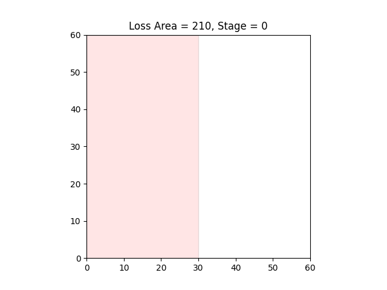

# Placement-Optimizer

## Overview
長方形詰め込み問題の最適化を、局所探索法で実装したリポジトリです。



## Requirement
- Ubuntu 20.04 LTS
- Python 3.10

## Setup
以下を実行してください。
```sh
python3 -m venv venv
. venv/bin/activate
pip3 install -e .
```

## Usage

### 1. Data Generation
以下を実行してください。
```sh
cd src/data_generator
python3 main.py
```

### 2. Optimization
以下を実行してください。
```sh
cd src/optimizer
python3 main.py
```

### 3. Vizualization
以下を実行してください。
```sh
cd src/visualizer
python3 main.py
```